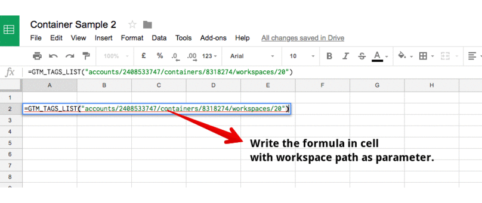

# GTM.gs 
GTM Manager lets you work with Google Tag Manager in Google Sheets.

## Quick start
Create new spreadsheet, install add-on.

* paste function GTM_ACCOUNTS_LIST()
* Run 
* Get result




## Pathes
Most functions parameters are pathes (workspace, tag or folder).
You can find path in GTM page URL:  
https://tagmanager.google.com/#/container/accounts/286472777/containers/22777/workspaces/82/variables/12

where:
* accountPath – accounts/286472777    
* containerPath – accounts/286472777/containers/22777
* workspacePath –  accounts/286472777/containers/22777/workspaces/82
* foldersPath –  accounts/286472777/containers/22777/workspaces/82
* variablePath – accounts/286472777/containers/22777/workspaces/82/variables/12

## Functions
Write functions in sheets cell.

ACCOUNT
* GTM_ACCOUNT_LIST()
* GTM_CONTAINER_LIST(accountPath)
* GTM_VERSION(workspacePath)

WORKSPACE
* GTM_WORKSPACE_LIST(containerPath)
* GTM_WORKSPACE_LIST_ALL()
* GTM_WORKSPACE_SET_SHEET()
* GTM_WORKSPACE_GET_SHEET()

FOLDER
* GTM_FOLDER_LIST(workspacePath)
* GTM_FOLDER_COPY(workspacePath,to_workspacePath)

TAGS
* GTM_TAGS_LIST(workspacePath)
* GTM_TAGS_LIST_NOTES(workspacePath)
* GTM_TAGS_ANALYTICS(workspacePath)
* GTM_TAG_BY_ID(id, workspacePath)
* GTM_TAG_UPDATE_CM(key, val, tagPath)
* GTM_TAG_UPDATE_CD(key, val, tagPath)
* GTM_TAG_UPDATE_CG(key, val, tagPath)
* GTM_TAG_UPDATE_EA(val, tagPath)
* GTM_TAG_UPDATE_EL(val, tagPath)
* GTM_TAG_UPDATE_EC(val, tagPath)
* GTM_TAG_UPDATE_EVENT(key, val, tagPath)

VARIABLES
* GTM_VARIABLES_LIST(workspacePath)
* GTM_VARIABLE_CUSTOM_JS_CREATE(name, javaScript, workspacePath)
* GTM_VARIABLE_JS_CREATE(name, javaScript, workspacePath)
* GTM_VARIABLES_CUSTOM_JS_UPDATE(javaScript, variablePath)
* GTM_VARIABLES_LIST_PARAMS(workspacePath)

TRIGGERS
* GTM_TRIGGERS_LIST(workspacePath)

ITEMS
* GTM_ITEMS_LIST(workspacePath)
* GTM_COPY(itemPath, to_workspacePath)
* GTM_RENAME(itemPath, name)
* GTM_NOTES_ADD(itemPath, notes)
* GTM_NOTES_LIST(workspacePath)
* GTM_LINK(path)
* GTM_ITEM_REMOVE(itemPath)
* GTM_ITEM_REVERT(itemPath)
* GTM_FIND(needle, workspacePath)
* GTM_RELATIONS(workspacePath)
    
    

## Result
Most functions return pair [path, name]
```=GTM_TAGS_LIST("workspacePath");```
retrurns

| path | name |  
| --- | --- |   
| /path/workspace/tag/32 | Tag name |
| /path/workspace/tag/32 | Tag name |


*  GTM_NOTES_LIST(workspacePath) - returns item [name, path, type, notes]  
* GTM_COPY(itemPath, to_workspacePath) - copy item to another workspace
* GTM_FOLDER_COPY(folderPath, to_workspacePath) - copy folder with items to another workspace. Breaks if item name exist at acceptor workspace.
* GTM_RENAME(itemPath, name) - rename item
* GTM_WORKSPACE_LIST_ALL - return all accounts, containers and workspaces
* GTM_TAGS_ANALYTICS - return all analytics tags
* GTM_NOTES_ADD(itemPath, notes) - create/update notes for item

Note
Don't use nested GTM functions:
-GTM_A(GTM_B)-
